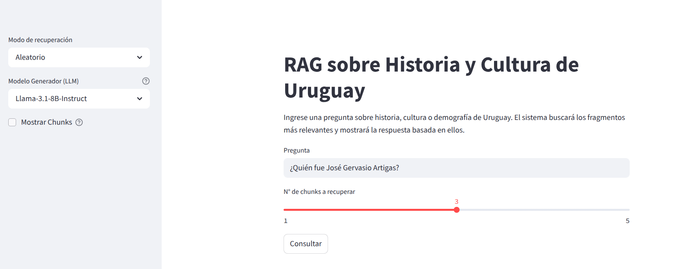
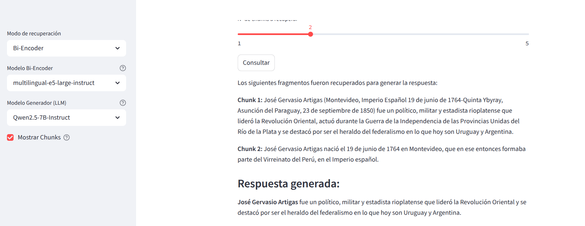

# RAG Uruguay Demo

_Noviembre 2024_

Sistema de Preguntas y Respuestas (QA) en español sobre Historia y Cultura de Uruguay usando modelos de lenguaje y recuperación semántica.

Este proyecto implementa un sistema RAG (Retrieval-Augmented Generation) que responde preguntas sobre historia, cultura y demografía de Uruguay. Utiliza artículos de Wikipedia, técnicas de chunking y modelos de recuperación semántica (bi-encoder) junto a modelos de lenguaje (LLM) para generar respuestas fundamentadas en los textos recuperados.

### Autores
- Steven Estramil
- Daniel Padron
- Agustin Recoba

## Estructura del Proyecto
- `notebook.ipynb`: Contiene todo el proceso de desarrollo, experimentación y conclusiones del proyecto.
- `testset.csv`: Preguntas de prueba y respuestas esperadas.
- `requirements.txt`: Dependencias.
- `src/app.py`: Interfaz principal con Streamlit.
- `src/rag/`: Módulos de chunking, recuperación y generación.
- `readme_media/`: Imágenes para el README.

## Demo



## Instalación
1. Clona el repositorio:
   ```bash
   git clone <url-del-repo>
   cd qa-rag-demo-espanol
   ```
2. Instala las dependencias:
   ```bash
   pip install -r requirements.txt
   ```

## Uso
Ejecuta la aplicación con Streamlit:
```bash
streamlit run src/app.py
```

Abre el navegador en la URL que indica Streamlit (por defecto http://localhost:8501).

## Ejemplo de Consulta
- Escribe una pregunta sobre Uruguay (ej: "¿Quién fue José Gervasio Artigas?").
- Selecciona el modelo de recuperación y el modelo generador.
- Haz clic en "Consultar" para ver la respuesta generada y los fragmentos utilizados.
